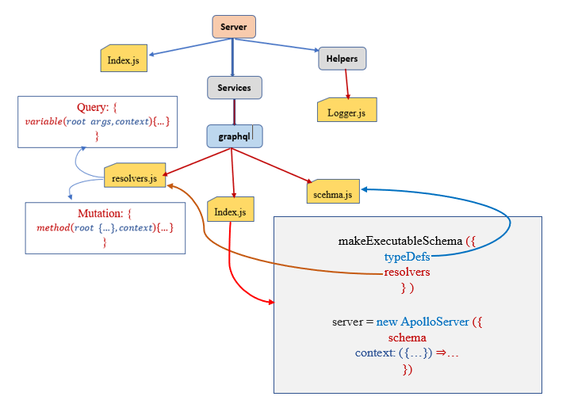

<a name="readme-top"></a>

<div align="center">
  
  <br/>

  <h3><b>Full-stack web development with GraphQL and React </b></h3>

</div>

<!-- TABLE OF CONTENTS -->

# 📗 Table of Contents

- [📖 About the Project](#about-project)
  - [🛠 Built With](#built-with)
    - [Tech Stack](#tech-stack)
    - [Key Features](#key-features)
  - [🚀 Live Demo](#live-demo)
- [💻 Getting Started](#getting-started)
  - [Setup](#setup)
  - [Prerequisites](#prerequisites)
  - [Install](#install)
  - [Usage](#usage)
  - [Run tests](#run-tests)
  - [Deployment](#triangular_flag_on_post-deployment)
- [👥 Authors](#authors)
- [🔭 Future Features](#future-features)
- [🤝 Contributing](#contributing)
- [⭐️ Show your support](#support)
- [🙏 Acknowledgements](#acknowledgements)
- [❓ FAQ (OPTIONAL)](#faq)
- [📝 License](#license)

<!-- PROJECT DESCRIPTION -->

# 📖Full-Stack Web Development with GraphQL and React  <a name="about-project"></a>


**react-graphql-text-book** is a...

## 🛠 Built With <a name="built-with"></a>

### Tech Stack <a name="tech-stack"></a>

> Describe the tech stack and include only the relevant sections that apply to your project.

<details>
  <summary>Client</summary>
  <ul>
    <li><a href="https://reactjs.org/">React.js</a></li>
  </ul>
</details>

<details>
  <summary>Server</summary>
  <ul>
    <li><a href="https://expressjs.com/">Express.js</a></li>
  </ul>
</details>

<details>
<summary>Database</summary>
  <ul>
    <li><a href="https://www.postgresql.org/">PostgreSQL</a></li>
  </ul>
</details>

<!-- Features -->

### Key Features <a name="key-features"></a>

> Describe between 1-3 key features of the application.

- **[key_feature_1]**
- **[key_feature_2]**
- **[key_feature_3]**

<p align="right">(<a href="#readme-top">back to top</a>)</p>

<!-- LIVE DEMO -->

## 🚀 Live Demo <a name="live-demo"></a>

> Add a link to your deployed project.

- [Live Demo Link](https://google.com)

<p align="right">(<a href="#readme-top">back to top</a>)</p>

<!-- GETTING STARTED -->

## 💻 Getting Started <a name="getting-started"></a>

> Describe how a new developer could make use of your project.

To get a local copy up and running, follow these steps.

### Prerequisites


In order to run this project you need:

<!--
Example command:

```sh
 gem install rails
```
 -->

### Setup

Clone this repository to your desired folder:

<!--
Example commands:

```sh
  cd my-folder
  git clone git@github.com:myaccount/my-project.git
```
--->

### Install

Install this project with:

<!--
Example command:

```sh
  cd my-project
  gem install
```
--->

### Usage

To run the project, execute the following command:

<!--
Example command:

```sh
  rails server
```
--->

### Run tests

To run tests, run the following command:

<!--
Example command:

```sh
  bin/rails test test/models/article_test.rb
```
--->

### Deployment

You can deploy this project using:

<!--
Example:

```sh

```
 -->

<p align="right">(<a href="#readme-top">back to top</a>)</p>

## Description 
## React

React makes ``re-rendering`` very efficient by using a virtual DOM, which compares the virtual and actual DOM and updates it accordingly. 
  - Only when there is a difference between the virtual and real DOM does React apply these changes.
- This logic ``stops the browser from recalculating the layout, Cascading Style Sheets (CSS), and other computations`` that negatively impact the overall performance of your application.

- When a ``component`` is updated, **_all of the components_** get updated simultaneously, then **_react compares the difference between the virtual DOM and the snapshot of the virtual DOM_**,
 

## webpack
- Webpack is a module bundler for ``JavaScript`` applications. It is primarily used to bundle JavaScript files, but it can also be used to bundle other types of assets such as ``stylesheets``, ``images``, and ``fonts``.
- Webpack works by taking a set of input files (known as "entry points") and creating a single output file that contains all of the necessary code and assets required to run the application. This output file is typically a ``JavaScript`` file that can be included in an HTML page and executed in a web browser.

- Another important feature of Webpack is its support for loaders. Loaders are used to preprocess files before they are included in the bundle. This can be useful for tasks such as transpiling modern JavaScript syntax, transforming CSS into a format that can be understood by the browser, and optimizing images.

- To bundle our JavaScript code, we need to install webpack and
all its dependencies, as follows:
```sh
npm install --save-dev @babel/core babel-loader @babel/presetenv @babel/preset-react clean-webpack-plugin css-loader fileloader html-webpack-plugin style-loader url-loader webpack
webpack-cli webpack-dev-server
```

## Node
**_Node.js_** is a JavaScript run-time environment that is fast, but it does not support ``request handling``, ``HTTP methods``, or serving files. So, this is where ``Express JS`` comes into the picture.

**_Express_** is a ``Node.js`` framework, designed for building APIs, web applications, and cross-platform mobile apps.
- Chxs of Express JS are:
>	- High performance
>	- Fast
>	- Unopinionated
>	- Lightweight

Express.js is also the most used Node.js web server out there and describes itself as a Node.js web framework, offering all the main features needed to build web applications.

### Features of Express JS
- **Fast server-side development** – with the help of Node.js features, express can save a lot of time
- **_Middleware_**: it is a request handler that has access to the application’s request-response cycle.
    - **_Express.js_** provides us with great ways to write efficient backends without duplicating code.
    - ``Every middleware function receives a request, a response, and next``. It needs to run next to pass control to the next handler function. Otherwise, you will receive a timeout. Middleware allows us to pre- or post-process the request or response object, execute custom code, and much more.
- **_Routing_** – refers to how an applications endpoints (URIs) respond to client request
- **_Templating_** – creates an HTML template file with less code and renders HTML pages
- **_Debugging_** – express makes it easier as it identifies the exact part where bugs are

Usage:
```sh
npm install --save express
import express from 'express'; 
const app = express ();

app.METHOD('path', (req, res) => res.send('Hello World!'));
app.listen(port, () => console.log('Listening on port 8000!'));
```
- The first parameter for ``all the app.METHOD`` functions are the path to match. From here, you can provide an unlimited list of ``callback functions``, which are executed one by one. 
- A ``callback`` always receives the ``client request`` as the first parameter and the response as the second parameter, which the server is going to send. Our first callback is going to use the send response method

**_Running Express.js in development_**
```sh
npm install --save nodemon
```
**_nodemon_** is an excellent tool for running a Node.js application. It can restart your server when the source changes.

```sh
"server": "nodemon --exec babel-node --watch src/server src/ server/index.js"
```

- To get the above command working, follow these steps:
```npm install --save-dev @babel/node``` - since we are transpiling the backend code with Babel using the ``--exec babel-node`` option. 

- Providing the ``--watch`` option to ``nodemon`` when following a path or file will permanently track the changes on that file or folder and reload the server to represent the latest state of your application. The last parameter refers to the actual file being the starting execution point for the backend.

  ```npm run server```
### GraphQL schema basics
Your GraphQL server uses a ``schema`` to describe the shape of your available data. This schema defines a hierarchy of ``types`` with ``fields`` that are populated from your back-end data stores. The schema also specifies exactly which ``queries`` and ``mutations`` are available for clients to execute. [Read More...](https://www.apollographql.com/docs/apollo-server/schema/schema)

- Each field returns data of the type specified. A field's return type can be a ``scalar``, ``object``, ``enum``, ``union``, or ``interface``.

- **_GraphQL_** scalars types
  > - ID
  > - string
  > - Int
  > - Float
  > - Boolean


- Let's assume we have the following User data:


      type User {
        id: ID!
        name: string!
        age: Int!
        height: Float!
        address: string!
        isMarried: string
      }
        The exclamation mark indicates that the attribute is required

> What if a user has list of friends?... well GraphQL has a solution for that.

    ...
    friends: [Users]

> This implies that a user has list of Friends
- Similarly if a user has a list of posts for which the post is defined as 


      type Post {
        id: ID!
        title: string!
        post: string!
      }

- So we can relate Post and User as:

      type User {
        ...
        posts: [Post]
      }

### Nullability and lists

    type User {
      posts: [Post!]! # This list can't be null AND its list *items* can't be null
    }


### The Query type
- The ``Query`` type is a special object type that defines all of the top-level entry points for queries that clients execute against your server.

### Example

    type Book {
      title: String
      author: Author
    }

    type Author {
      name: String
      books: [Book]
    }

- Each field of the ``Query`` type defines the name and return type of a different entry point. The ``Query`` type for our example schema might resemble the following:


      type Query {
        books: [Book]
        authors: [Author]
      }


- Our query may look like the following:


      query GetBooksAndAuthors {
        books {
          title
        }

        authors {
          name
        }
      }


- From our example above, if we want to get User details

      query getUser {
        name
        age
        height
        address
        ...

        friends {
          name
          age
          ...
        }

        posts {
          title
          descriptions
        }
        ...
      }

### The Mutation type
The ``Mutation`` type is similar in structure and purpose to the ``Query`` type. Whereas the ``Query`` type defines **_entry points_** for **_read operations_**, the ``Mutation`` type defines **_entry points_** for **_write operations_**.

      type Mutation {
        addPost(title: String, description: String): Post
      }


- This ``Mutation`` type defines a single available ``mutation``, **_addPost_**. The mutation accepts two arguments ``(title and author)`` and returns a newly created ``Post`` object.


      mutation CreatePost {
        addPost(title: "The new post", description: "This is a description of new post") {
          title
          description
        }
      }


### Input types
- Input types are special object types that allow you to provide hierarchical data as arguments to fields (as opposed to providing only flat scalar arguments).


      input UserInput {
        name:string!
        age:int!
        address: string!
        ...
      }

      sh
        input PostInput {
          title: string!
          description: string!
        }

      type RootMutation {
      addPost (post: PostInput!, user: UserInput!): Post
      }



<hr/>
<!-- AUTHORS -->

## 👥 Authors <a name="authors"></a>


👤 **Belay Birhanu G**

- GitHub: [@githubhandle](https://github.com/belaymit)
- Twitter: [@twitterhandle](https://twitter.com/2belamit)
- LinkedIn: [LinkedIn](https://www.linkedin.com/in/belay-birhanu-144ba714b/)

<p align="right">(<a href="#readme-top">back to top</a>)</p>

<!-- FUTURE FEATURES -->

## 🔭 Future Features <a name="future-features"></a>

> Describe 1 - 3 features you will add to the project.

- [ ] **[new_feature_1]**
- [ ] **[new_feature_2]**
- [ ] **[new_feature_3]**

<p align="right">(<a href="#readme-top">back to top</a>)</p>

<!-- CONTRIBUTING -->

## 🤝 Contributing <a name="contributing"></a>

Contributions, issues, and feature requests are welcome!

Feel free to check the [issues page](../../issues/).

<p align="right">(<a href="#readme-top">back to top</a>)</p>

<!-- SUPPORT -->

## ⭐️ Show your support <a name="support"></a>

> Write a message to encourage readers to support your project

If you like this project...

<p align="right">(<a href="#readme-top">back to top</a>)</p>

<!-- ACKNOWLEDGEMENTS -->

## 🙏 Acknowledgments <a name="acknowledgements"></a>

> Give credit to everyone who inspired your codebase.

I would like to thank...

<p align="right">(<a href="#readme-top">back to top</a>)</p>

<!-- FAQ (optional) -->

## ❓ FAQ (OPTIONAL) <a name="faq"></a>

> Add at least 2 questions new developers would ask when they decide to use your project.

- **[Question_1]**

  - [Answer_1]

- **[Question_2]**

  - [Answer_2]

<p align="right">(<a href="#readme-top">back to top</a>)</p>

<!-- LICENSE -->

## 📝 License <a name="license"></a>

This project is [MIT](./MIT.md) licensed.


<p align="right">(<a href="#readme-top">back to top</a>)</p>
